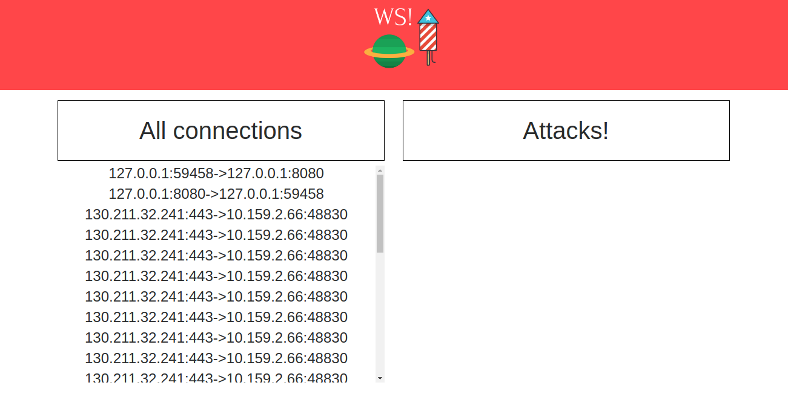
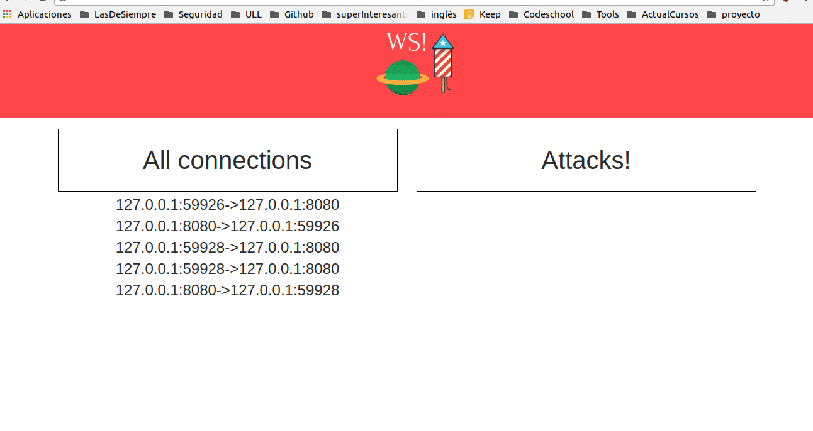

> A WebSniffer for tcp connections attemps, detect connections to closed ports

## DEMO

## About Websniffer

Websniffer detect connections throw rawsockets, decode the information in server and send the notifies to the client with Websockets.
The code is inspired in [PortDog](https://github.com/puniaze/PortDog)

## Disclaimer

The display of connections attemps has a delay and probably some connections are lost because if WebSniffer print all the connections (WebSocket -> 8080 include) the browser crash :).
